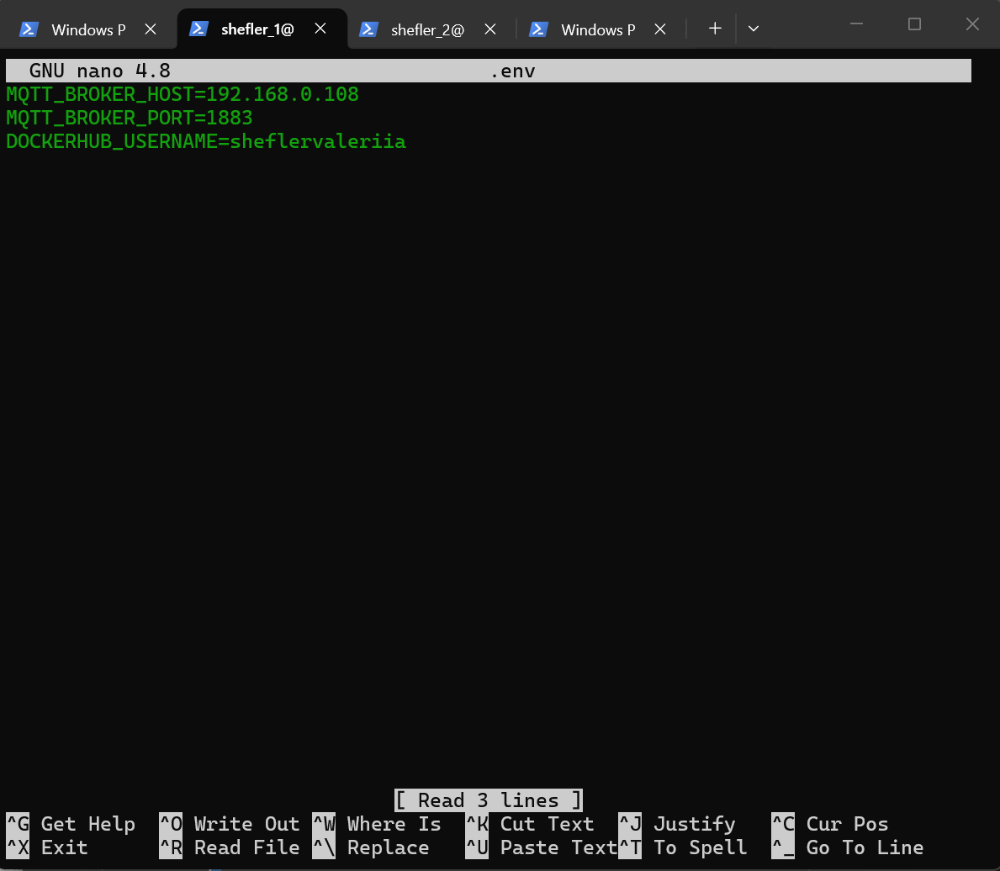
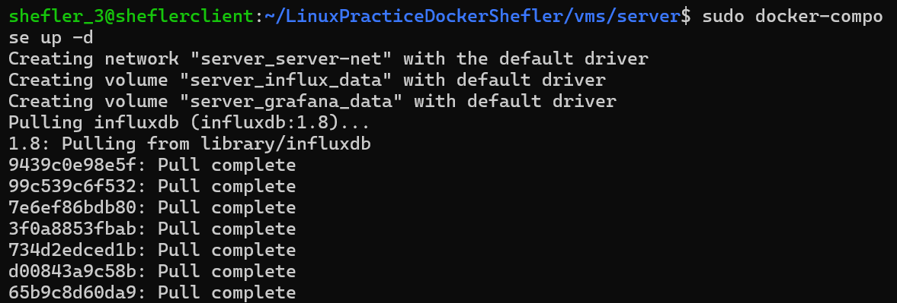
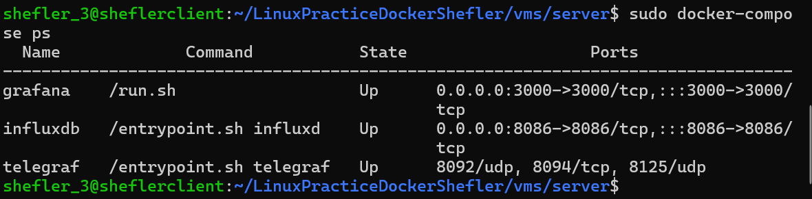

# ИНСТРУКЦИЯ ПО РАБОТЕ С ЗАДАНИЕМ DockerPractice ШЕФЛЕР
## Подготовка:
Необходимо иметь:  
    - Ссылку на репозиторий гитхаб студента
    - Ссылку на репозиторий докерхаб студента
    - Три виртаульные машины с задания по Линукс-администрированию
    - На каждой машине необходимо установить: git, docker, docker-compose
    - На хост необходимо скачать MQTT Explorer

# 1. Проверка репозитория
Произведем клонирование репозитория студента на каждую виртуальную машину:  
    git clone ** ссылка **  
    cd ** название репозитория **  
    ls -R  
      
На машине LinuxA внесем ряд изменений в файл env. (адрес нашей машины B c mosquitto и интересующий нас докерхаб), предварительно перейдя в папку репозитория например:  
      
      
На этой же машине запустим контейнеры с сенсорами и просмотрим (важно: находясь в папке client):  
    
Аналогично поступим и на машине B (важно: теперь в папке gateway):  
      
Проверим с помощью MQTT Explorer:  
      
Перейдя на машину С также внесем ряд изменений в файл env. (адрес нашей машины B c mosquitto):  

На машине С также запустим и посмотрим контейнеры (важно: находясь в папке server):  
      
      
Убедившись, что все в порядке, вводим следующие команды: