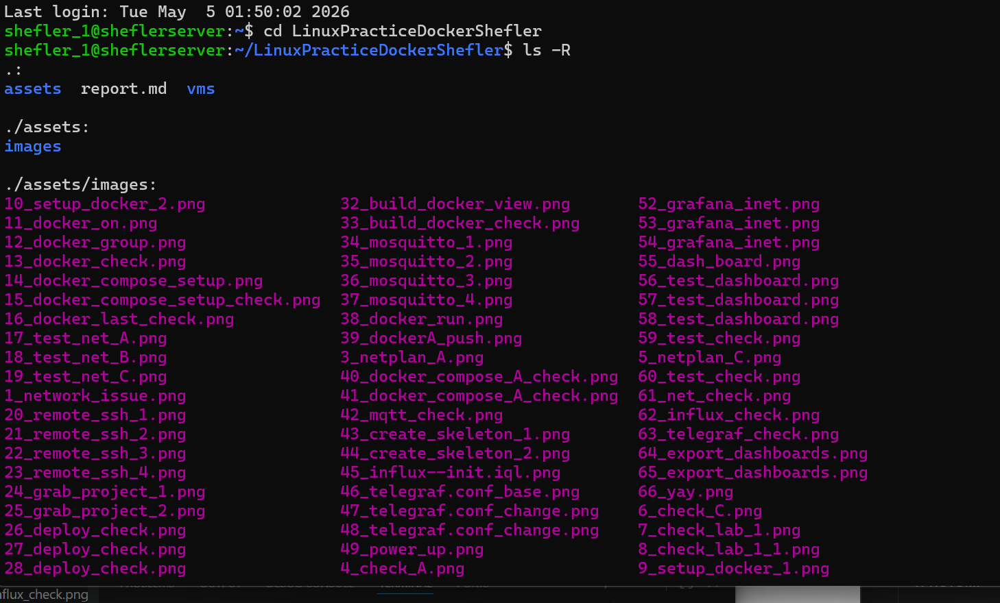
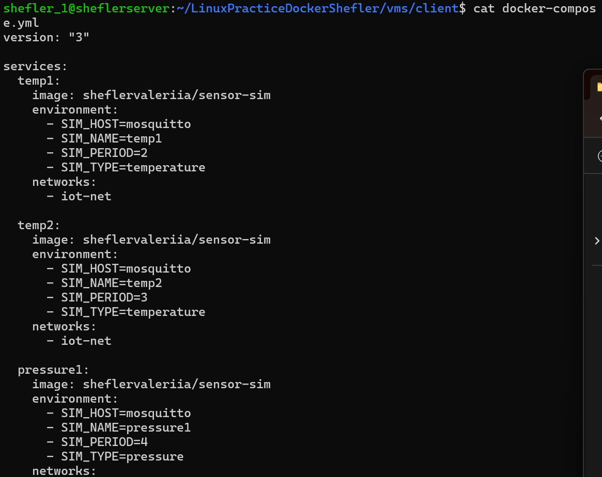
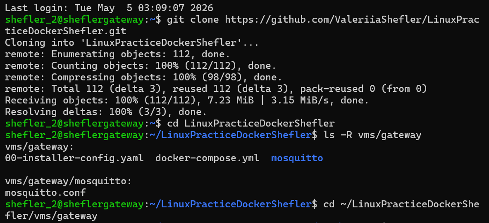
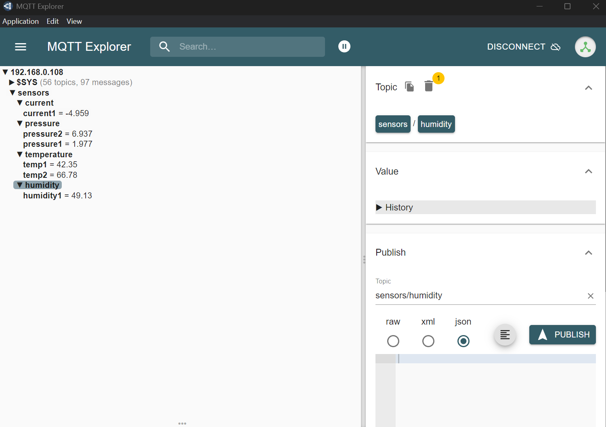
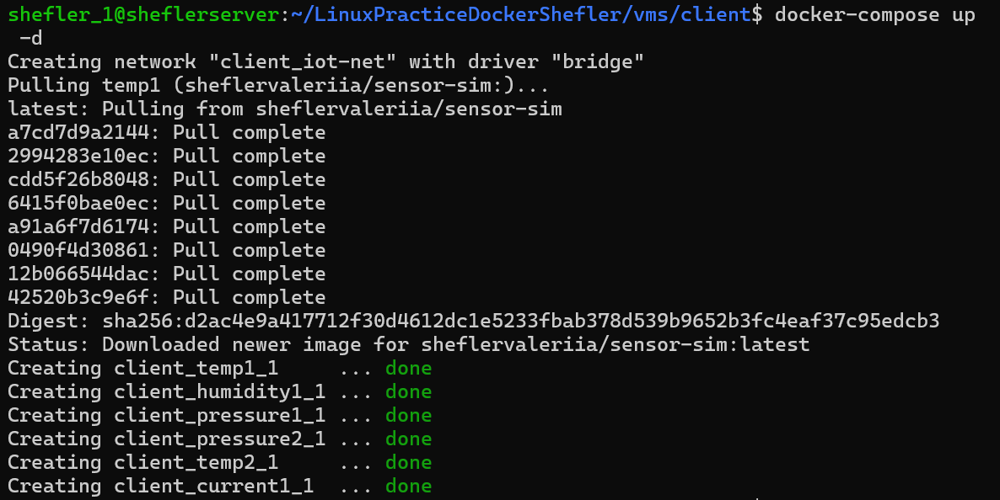

# ИНСТРУКЦИЯ ПО РАБОТЕ С ЗАДАНИЕМ DockerPractice ШЕФЛЕР
## Подготовка:
Необходимо иметь:  
    - Ссылку на репозиторий гитхаб студента
    - Ссылку на репозиторий докерхаб студента
    - Три виртаульные машины с задания по Линукс-администрированию
    - На каждой машине необходимо установить: git, docker, docker-compose

# 1. Проверка репозитория
На машине LinuxA произведите клонирование репозитория студента и просмотрите структуру:  
    git clone ** ссылка **  
    cd ** название репозитория **  
    ls -R  
      
Проверим, что в docker-compose файле нужное количество датчиков:  
      
На машине B также произведем клонирование репозитория студента аналогичным образом и произведем запуск docker-compose:  
      
Проверим конфигурацию moquitto:  
      
Вернемся на машину LinuxA. Когда мы в директории ~/* название репозитория */vms/client произведем запуск docker-compose и проверку:  
      
